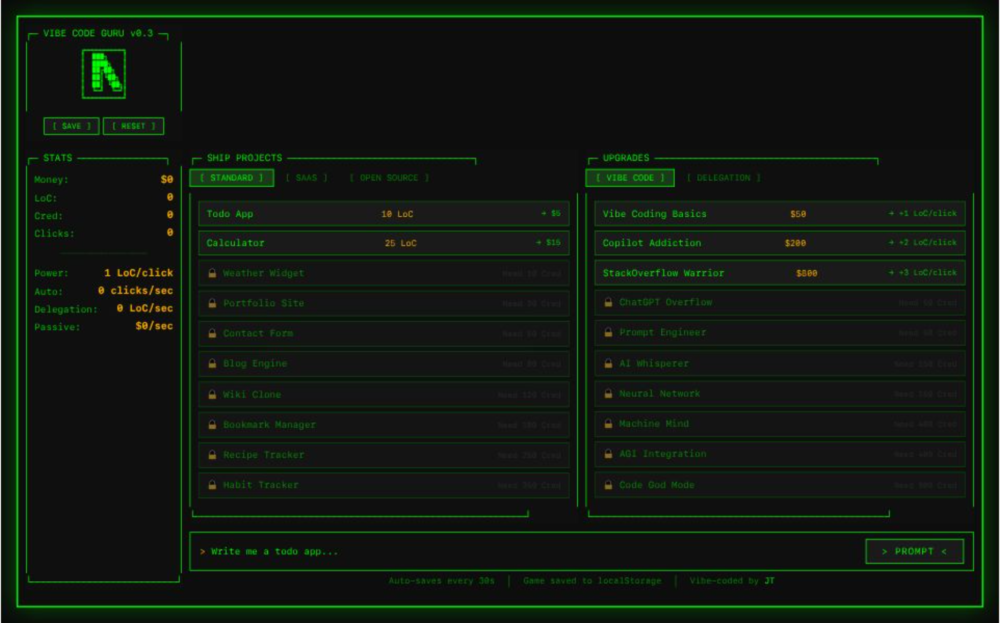

# ✨ Vibe Code Guru

> A degenerate idle clicker game about vibe coding your way to $1B market cap 🚀

You're a developer. You have a keyboard. You have AI that will write code for you (sort of).

**Your mission:** Ship projects, earn cred, upgrade your vibe, and become the ultimate prompt engineer.



---

## 🎮 How to Play

1. **Click the prompt button** to generate Lines of Code (LoC) 💻
2. **Ship projects** to earn money 💰 and cred ⭐
3. **Buy upgrades** to automate the suffering:
   - **Vibe Code** → More LoC per click
   - **Delegation** → Hire help (interns, juniors, seniors, eventually AI)
4. **Unlock** new projects as your cred grows

---

## 🛠️ Tech Stack

- **Svelte 5** with runes ✨
- **TypeScript** for type safety 😤
- **Vite** for speedy builds ⚡
- **pnpm** for package management 📦

---

## 🚀 Getting Started

```bash
# Clone the repo
git clone https://github.com/yourusername/vibe-code-guru.git
cd vibe-code-guru

# Install dependencies
pnpm install

# Start the vibes
pnpm dev
```

Then open `http://localhost:5173` and start vibing.

---

## 🎯 Contributing

Got ideas? Found a bug? Want to add a new project or upgrade?

**Yes, please!** This is a hobby project built for fun, and PRs are always welcome.

### Ideas for Contributions

- New project types (mobile apps, blockchain, AI startups...)
- More upgrades (ergonomic keyboard, coffee machine, standing desk...)
- UI improvements (animations, sounds, easter eggs)
- Quality of life features (save export/import, statistics)
- Documentation (you're reading it!)

### How to Contribute

1. Fork the repo
2. Create a branch: `git checkout -b feature/my-cool-idea`
3. Make your changes (following the existing code style)
4. Push and open a PR

---

## 📁 Project Structure

```
src/
├── lib/
│   ├── components/     # Svelte components (panels, UI)
│   └── game/          # Game logic, types, constants
│       ├── constants.ts    # Projects, upgrades, unlocks
│       ├── store.svelte.ts # Game state management
│       ├── types.ts        # TypeScript interfaces
│       └── utils.ts        # Helper functions
├── App.svelte         # Main app component
├── app.css            # Global styles (TUI aesthetic)
└── main.ts            # Entry point
```

---

## 🎨 Design Philosophy

- **Keep it fun** - This is a meme game, don't take it too seriously
- **Type-safe** - Use TypeScript properly, no `any` allowed (unless it's funny)
- **Minimal deps** - If you can code it yourself, do it
- **Svelte 5** - Use the new runes API, it's the future

---

## 📝 License

MIT - go forth and vibe.

---

## 🤝 Credits

Built with 💚, ☕, and too many AI prompts.

---

**Happy vibing!**

_"It works on my machine" - said every developer, ever_
