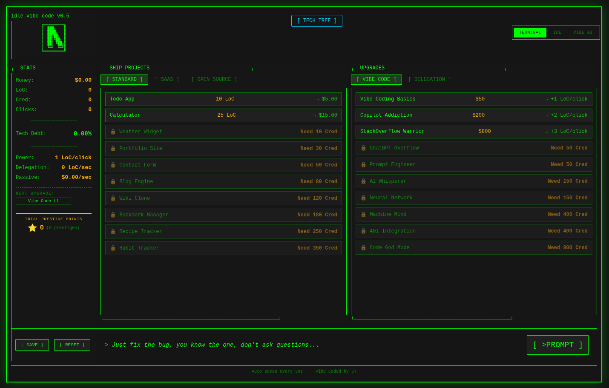

# ✨ Idle Vibe Code Quest

> A degenerate idle clicker game about vibe coding your way to $1B market cap 🚀

You're a developer. You have a keyboard. You have AI that will write code for you (sort of).

**Your mission:** Ship projects, earn cred, upgrade your vibe, accumulate tech debt, and become the ultimate prompt engineer.



---

## 🎮 How to Play

1. **Click the prompt button** to generate Lines of Code (LoC) 💻
2. **Ship projects** to earn money 💰 and cred ⭐
3. **Buy upgrades** to automate the suffering:
   - **Vibe Code** → More LoC per click
   - **Delegation** → Hire help (interns, juniors, seniors, eventually AI)
   - **Tech Tree** → Unlock powerful permanent upgrades
4. **Watch out for tech debt** 📉 - it slows you down as you grow
5. **Prestige** 🌟 when you hit the wall - reset for permanent meta-upgrades
6. **Offline gains** - come back later, we've been vibing without you
7. **Random events** - because chaos is part of the startup experience
8. **Unlock** new projects as your cred grows

---

## 🛠️ Tech Stack

- **Svelte 5** with runes ✨
- **TypeScript** for type safety 😤
- **Vite** for speedy builds ⚡
- **pnpm** for package management 📦
- **Fully responsive** - vibe on desktop or mobile 📱
- **Dark/light themes** - code in your preferred aesthetic 🌙☀️

---

## 🚀 Getting Started

```bash
# Clone the repo
git clone https://github.com/popidge/idlevibecodequest.git
cd idle-vibe-code-quest

# Install dependencies
pnpm install

# Start the vibes
pnpm dev
```

Then open `http://localhost:5173` and start vibing.

---

## 🎯 Contributing

Got ideas? Found a bug? Want to add a new project or upgrade?

**Yes, please!** This is a hobby project built for fun, and PRs are always welcome.

### Ideas for Contributions

- New project types (Web3, quantum computing, space startups...)
- More upgrades (mechanical keyboard, standing desk, second monitor...)
- Sounds and music (keyboards clacking, lo-fi beats to vibe/code to)
- Easter eggs (konami code, secret projects, achievements)
- Quality of life features (save export/import, detailed statistics)
- Localization (translate the vibes to other languages)
- Documentation (you're reading it!)

### How to Contribute

1. Fork the repo
2. Create a branch: `git checkout -b feature/my-cool-idea`
3. Make your changes (following the existing code style)
4. Push and open a PR

---

## 📁 Project Structure

```
src/
├── lib/
│   ├── components/          # Svelte components (panels, UI, modals)
│   │   ├── mobile/          # Mobile-optimized layout components 📱
│   │   └── *.svelte         # Various panels and modal components
│   ├── stores/              # Responsive state and other stores
│   └── game/                # Game logic, types, constants
│       ├── constants.ts     # Projects, upgrades, unlocks
│       ├── store.svelte.ts  # Game state management
│       ├── tuning-sim.ts    # Balance tuning simulator
│       ├── types.ts         # TypeScript interfaces
│       └── utils.ts         # Helper functions
├── App.svelte              # Main app component
├── app.css                 # Global styles (TUI aesthetic)
└── main.ts                 # Entry point
```

---

## 🎨 Design Philosophy

- **Keep it fun** - This is a meme game, don't take it too seriously
- **Type-safe** - Use TypeScript properly, no `any` allowed (unless it's funny)
- **Minimal deps** - If you can code it yourself, do it
- **Svelte 5** - Use the new runes API, it's the future
- **Mobile-first** - Vibes should flow on any screen size
- **Dark by default** - We're developers, we live in the dark

---

## 📝 License

MIT - go forth and vibe.

---

## 🤝 Credits

Built with 💚, ☕, and too many AI prompts.

---

**Happy vibing!**

_"It works on my machine" - said every developer, ever_
