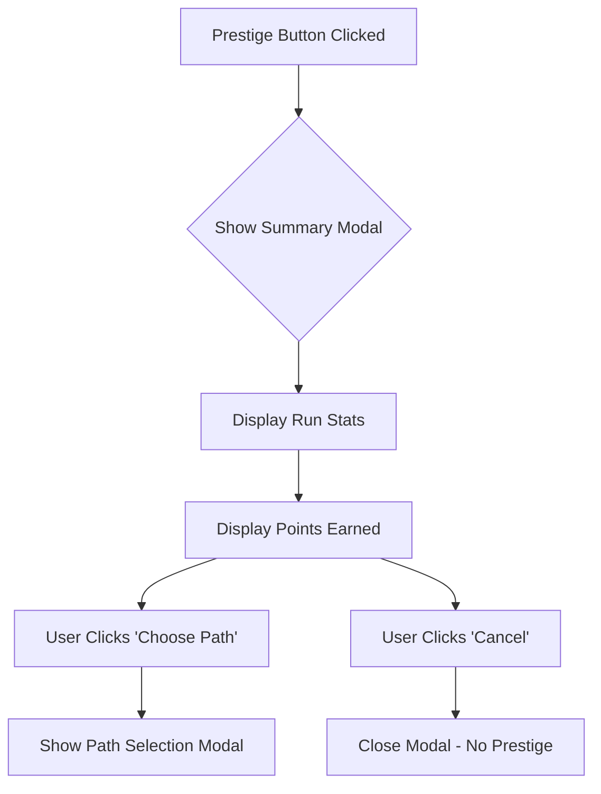

# Phase 3: Prestige Loop - Implementation Plan

## Overview
Implementing the core meta-progression system that gives players permanent bonuses and a reason to reset. This includes prestige threshold detection, path selection, and reset logic.

---

## 3.1 Data Structure Changes

### 3.1.1 Update `src/lib/game/types.ts`
Add prestige-related interfaces:

```typescript
// Prestige path type
export type PrestigePath = 'buyout' | 'nirvana' | 'linus';

// Prestige bonuses object
export interface PrestigeBonuses {
    startingCash: number;
    cashMultiplier: number;
    locMultiplier: number;
    credMultiplier: number;
}

// Prestige state (persisted)
export interface PrestigeState {
    prestigePoints: number;
    totalPrestiges: number;
    pathHistory: PrestigePath[];
    runStartTime: number;
    totalCashEarnedThisRun: number;
    bonuses: PrestigeBonuses;
}

// Update GameState to include prestige
export interface GameState {
    // ... existing fields
    prestige?: PrestigeState;
}

// Prestige summary for confirmation modal
export interface PrestigeSummary {
    pointsEarned: number;
    runDuration: string;
    cashEarned: number;
    projectsShipped: number;
    upgradesOwned: number;
}
```

### 3.1.2 Update `src/lib/game/constants.ts`
Add prestige constants:

```typescript
export const PRESTIGE = {
    THRESHOLD_PERCENT: 0.7,              // 70% of upgrades owned
    STARTING_CASH_PER_POINT: 5000,        // +$5,000 per point
    CASH_MULTIPLIER_PER_POINT: 0.20,      // +20% per point (additive)
    LOC_MULTIPLIER_PER_POINT: 0.15,       // +15% per point (additive)
    CRED_MULTIPLIER_PER_POINT: 0.25,      // +25% per point (additive)
    MIN_POINTS: 1,                        // Minimum prestige points
} as const;
```

---

## 3.2 Store Changes

### 3.2.1 Update `src/lib/game/store.svelte.ts`

#### Add new state properties:
```typescript
// Phase 3: Prestige system state
showPrestigeModal = $state(false);
showPrestigeSummaryModal = $state(false);
pendingPrestigePoints = $state(0);
selectedPrestigePath = $state<PrestigePath | null>(null);
```

#### Add computed properties:
```typescript
// Total upgrades available (vibeCode 1-10 + delegation 1-10 = 20 total)
get totalUpgradesAvailable() {
    return UPGRADES.vibeCode.length + UPGRADES.delegation.length;
}

// Count total upgrades owned
get totalUpgradesOwned() {
    let owned = 0;
    for (const level in this.gameState.upgrades.vibeCode) {
        owned += this.gameState.upgrades.vibeCode[level];
    }
    for (const level in this.gameState.upgrades.delegation) {
        owned += this.gameState.upgrades.delegation[level];
    }
    return owned;
}

// Percentage of upgrades owned (0-1)
get upgradePercentage() {
    return this.totalUpgradesOwned / this.totalUpgradesAvailable;
}

// Is prestige available at 70% threshold?
get isPrestigeAvailable() {
    return this.upgradePercentage >= PRESTIGE.THRESHOLD_PERCENT;
}

// Calculate prestige points to earn
get prestigePointsToEarn() {
    // Formula: floor(log10(total cash + 1))
    const cash = this.gameState.prestige?.totalCashEarnedThisRun ?? this.gameState.resources.money;
    const points = Math.floor(Math.log10(cash + 1));
    return Math.max(points, PRESTIGE.MIN_POINTS);
}

// Effective multipliers with prestige bonuses
get effectiveCashMultiplier() {
    const base = 1;
    const prestigeBonus = this.gameState.prestige?.bonuses.cashMultiplier ?? 0;
    return base + prestigeBonus;
}

get effectiveLocMultiplier() {
    const base = 1;
    const prestigeBonus = this.gameState.prestige?.bonuses.locMultiplier ?? 0;
    return base + prestigeBonus;
}

get effectiveCredMultiplier() {
    const base = 1;
    const prestigeBonus = this.gameState.prestige?.bonuses.credMultiplier ?? 0;
    return base + prestigeBonus;
}

get effectiveStartingCash() {
    return this.gameState.prestige?.bonuses.startingCash ?? 0;
}

// Track total cash earned this run
get totalCashEarnedThisRun() {
    return this.gameState.prestige?.totalCashEarnedThisRun ?? this.gameState.resources.money;
}
```

#### Add prestige methods:
```typescript
// Phase 3: Open prestige confirmation modal
openPrestigeConfirmation() {
    this.pendingPrestigePoints = this.prestigePointsToEarn;
    this.showPrestigeSummaryModal = true;
}

// Close prestige confirmation
closePrestigeConfirmation() {
    this.showPrestigeSummaryModal = false;
    this.pendingPrestigePoints = 0;
}

// Phase 3: Select prestige path and open path selection modal
selectPrestigePath(path: PrestigePath) {
    this.selectedPrestigePath = path;
    this.showPrestigeSummaryModal = false;
    this.showPrestigeModal = true;
}

// Close prestige path modal
closePrestigePathModal() {
    this.showPrestigeModal = false;
    this.selectedPrestigePath = null;
}

// Phase 3: Execute prestige
performPrestige(path: PrestigePath) {
    const pointsToEarn = this.pendingPrestigePoints;
    const previousRunDuration = Date.now() - (this.gameState.prestige?.runStartTime ?? Date.now());
    
    // Calculate bonuses based on path
    const startingCash = (path === 'buyout') 
        ? pointsToEarn * PRESTIGE.STARTING_CASH_PER_POINT 
        : this.gameState.prestige?.bonuses.startingCash ?? 0;
    
    const cashMultiplier = (path === 'buyout')
        ? pointsToEarn * PRESTIGE.CASH_MULTIPLIER_PER_POINT
        : this.gameState.prestige?.bonuses.cashMultiplier ?? 0;
    
    const locMultiplier = (path === 'nirvana')
        ? pointsToEarn * PRESTIGE.LOC_MULTIPLIER_PER_POINT
        : this.gameState.prestige?.bonuses.locMultiplier ?? 0;
    
    const credMultiplier = (path === 'linus')
        ? pointsToEarn * PRESTIGE.CRED_MULTIPLIER_PER_POINT
        : this.gameState.prestige?.bonuses.credMultiplier ?? 0;
    
    // Reset game state (preserve prestige data)
    this.gameState.resources = { money: 0, loc: 0, cred: 0 };
    this.gameState.upgrades = { vibeCode: {}, delegation: {} };
    this.gameState.projects = { standard: {}, saas: {}, openSource: {} };
    this.gameState.totalClicks = 0;
    this.gameState.techDebt = 0;
    this.gameState.projectsShipped = 0;
    
    // Apply starting cash bonus
    this.gameState.resources.money = startingCash;
    
    // Update prestige state
    if (!this.gameState.prestige) {
        this.gameState.prestige = {
            prestigePoints: 0,
            totalPrestiges: 0,
            pathHistory: [],
            runStartTime: Date.now(),
            totalCashEarnedThisRun: 0,
            bonuses: {
                startingCash: 0,
                cashMultiplier: 0,
                locMultiplier: 0,
                credMultiplier: 0
            }
        };
    }
    
    this.gameState.prestige.prestigePoints += pointsToEarn;
    this.gameState.prestige.totalPrestiges += 1;
    this.gameState.prestige.pathHistory.push(path);
    this.gameState.prestige.runStartTime = Date.now();
    this.gameState.prestige.totalCashEarnedThisRun = 0;
    
    // Accumulate bonuses (additive stacking)
    this.gameState.prestige.bonuses.startingCash += startingCash;
    this.gameState.prestige.bonuses.cashMultiplier += cashMultiplier;
    this.gameState.prestige.bonuses.locMultiplier += locMultiplier;
    this.gameState.prestige.bonuses.credMultiplier += credMultiplier;
    
    // Close modals and show notification
    this.showPrestigeModal = false;
    this.selectedPrestigePath = null;
    this.pendingPrestigePoints = 0;
    
    this.showNotification(`PRESTIGE! +${pointsToEarn} prestige points! New run begins...`);
}

// Track cash earned this run (call this whenever money increases)
trackCashEarned(amount: number) {
    if (this.gameState.prestige) {
        this.gameState.prestige.totalCashEarnedThisRun += amount;
    }
}
```

#### Update existing methods to track cash earned:
```typescript
// In handlePromptClick (if any cash rewards exist there)

// In shipProject:
this.gameState.resources.money += effectiveMoneyReward;
this.trackCashEarned(effectiveMoneyReward);  // Add this

// In passive income tick:
this.gameState.resources.money += this.effectivePassiveIncome;
this.trackCashEarned(this.effectivePassiveIncome);  // Add this
```

#### Update loadGame for backwards compatibility:
```typescript
// Ensure prestige fields exist (for backwards compatibility)
if (!this.gameState.prestige) {
    this.gameState.prestige = {
        prestigePoints: 0,
        totalPrestiges: 0,
        pathHistory: [],
        runStartTime: Date.now(),
        totalCashEarnedThisRun: this.gameState.resources.money,
        bonuses: {
            startingCash: 0,
            cashMultiplier: 0,
            locMultiplier: 0,
            credMultiplier: 0
        }
    };
}
```

#### Update resetGame to preserve prestige:
```typescript
// Optionally add a "Hard Reset" that clears prestige too
hardResetGame() {
    if (confirm('Are you sure? This will wipe ALL progress including prestige!')) {
        localStorage.removeItem('vibeCodeClicker');
        this.gameState = { ...defaultState };
        this.currentPrompt = PROMPT_MESSAGES[0];
        this.floatTexts = [];
        this.notifications = [];
        this.hints = [];
        this.debtLowHintShown = false;
        this.previousDebtState = 'low';
        this.showNotification('Full reset complete!');
    }
}
```

---

## 3.3 New Components

### 3.3.1 Create `src/lib/components/PrestigeSummaryModal.svelte`
Summary screen shown before selecting path.

**Features:**
- Displays "Previous run" stats
- Shows prestige points to be earned
- Confirm button to proceed to path selection
- Cancel button to dismiss

**Mermaid Flow:**


### 3.3.2 Create `src/lib/components/PrestigePathModal.svelte`
Path selection modal with three distinct choices.

**Features:**
- Three path cards with descriptions:
  - **Big Company Buyout**: 💰 Starting cash + cash multiplier
  - **Tech Bro Nirvana**: 💻 LoC generation multiplier
  - **The Linus Effect**: ⭐ Cred multiplier
- Shows current and projected bonuses for each path
- Visual distinction (amber border, subtle glow)
- Select button for each path

**Path Details:**
```typescript
const prestigePaths = [
    {
        id: 'buyout',
        name: 'Big Company Buyout',
        icon: '💰',
        description: 'Starting cash boost + cash income multiplier',
        baseBonus: `+${formatNumber(5000)} starting cash`,
        multiplierBonus: '+20% cash per point',
        currentBonus: store.gameState.prestige?.bonuses.startingCash ?? 0,
        currentMultiplier: store.gameState.prestige?.bonuses.cashMultiplier ?? 0
    },
    {
        id: 'nirvana',
        name: 'Tech Bro Nirvana',
        icon: '💻',
        description: 'LoC generation multiplier',
        baseBonus: '+15% LoC per point',
        currentMultiplier: store.gameState.prestige?.bonuses.locMultiplier ?? 0
    },
    {
        id: 'linus',
        name: 'The Linus Effect',
        icon: '⭐',
        description: 'Credibility gain multiplier',
        baseBonus: '+25% cred per point',
        currentMultiplier: store.gameState.prestige?.bonuses.credMultiplier ?? 0
    }
];
```

---

## 3.4 UI Updates

### 3.4.1 Update `src/lib/components/StatsPanel.svelte`

**Add below tech debt section:**
```svelte
<!-- Phase 3: Prestige Section -->
{#if store.isPrestigeAvailable}
    <div class="prestige-section">
        <button class="prestige-btn" onclick={() => store.openPrestigeConfirmation()}>
            ✨ PRESTIGE AVAILABLE! ✨
        </button>
        <div class="prestige-info">
            <span class="prestige-points">+{store.prestigePointsToEarn} points</span>
        </div>
    </div>
{/if}
```

**Add styles:**
```css
.prestige-section {
    margin-top: 8px;
    padding-top: 8px;
    border-top: 1px dashed var(--text-dim, #008800);
}

.prestige-btn {
    width: 100%;
    background-color: var(--button-bg, #1a1a1a);
    color: var(--text-amber, #ffb000);
    border: 2px solid var(--text-amber, #ffb000);
    padding: 8px 12px;
    font-family: 'Courier New', monospace;
    font-size: 11px;
    font-weight: bold;
    cursor: pointer;
    animation: prestigeGlow 2s infinite;
    text-transform: uppercase;
    letter-spacing: 1px;
}

@keyframes prestigeGlow {
    0%, 100% { box-shadow: 0 0 8px rgba(255, 176, 0, 0.5); }
    50% { box-shadow: 0 0 16px rgba(255, 176, 0, 0.8); }
}

.prestige-info {
    text-align: center;
    margin-top: 4px;
}

.prestige-points {
    color: var(--text-primary, #00ff00);
    font-size: 12px;
}
```

### 3.4.2 Update `src/lib/components/TitlePanel.svelte`

**Add prestige stats to panel footer:**
```svelte
<div class="panel-footer title-footer">
    <span class="prestige-display">
        {#if store.gameState.prestige?.prestigePoints}
            ⭐ {store.gameState.prestige.prestigePoints} pts
        {:else}
            ⭐ 0 pts
        {/if}
    </span>
    <button class="window-btn" onclick={() => store.saveGame()}>{{ SAVE }}</button>
    <button class="window-btn" onclick={() => store.resetGame()}>{{ RESET }}</button>
</div>
```

**Add styles:**
```css
.prestige-display {
    color: var(--text-amber, #ffb000);
    font-size: 10px;
    margin-right: 8px;
}
```

### 3.4.3 Update `src/lib/components/HintsContainer.svelte`

**Add prestige hint condition:**
```typescript
const conditions: { check: () => boolean; condition: Hint['condition']; message: string }[] = [
    // ... existing conditions
    {
        check: () => store.upgradePercentage >= PRESTIGE.THRESHOLD_PERCENT - 0.1,
        condition: 'prestigeSoon',
        message: 'Prestige available soon!'
    }
];
```

---

## 3.5 Integration

### 3.5.1 Update `src/App.svelte`

**Add imports:**
```svelte
// Phase 3: Prestige modals
import PrestigeSummaryModal from './lib/components/PrestigeSummaryModal.svelte';
import PrestigePathModal from './lib/components/PrestigePathModal.svelte';
```

**Add to template:**
```svelte
<!-- Phase 3: Prestige modals -->
<PrestigeSummaryModal />
<PrestigePathModal />
```

---

## 3.6 Version Bump

### 3.6.1 Update `package.json`
```json
{
    "version": "0.3.3"
}
```

### 3.6.2 Update `src/lib/components/TitlePanel.svelte`
```svelte
<div class="panel-header">┌─ idle-vibe-code v0.3.3 ─┐</div>
```

---

## Implementation Order

1. Update `types.ts` - Add prestige types
2. Update `constants.ts` - Add prestige constants
3. Update `store.svelte.ts` - Add state, computed props, methods
4. Create `PrestigeSummaryModal.svelte`
5. Create `PrestigePathModal.svelte`
6. Update `StatsPanel.svelte` - Add prestige button
7. Update `TitlePanel.svelte` - Add prestige stats
8. Update `HintsContainer.svelte` - Add prestige hint
9. Update `App.svelte` - Import and add modals
10. Bump version to 0.3.3

---

## Testing Checklist

- [ ] Prestige button appears at exactly 70% upgrade threshold
- [ ] Points calculation matches floor(log10(cash)) formula
- [ ] Minimum 1 point awarded even with low cash
- [ ] Path selection modal shows all three paths with correct bonuses
- [ ] Selecting a path applies correct bonuses
- [ ] Game state resets correctly (resources, upgrades, projects, debt)
- [ ] Prestige data is preserved across resets
- [ ] Starting cash is applied immediately after prestige
- [ ] Multipliers affect income in next run
- [ ] Save/load preserves prestige data
- [ ] Backwards compatibility with saves from v0.3.2
