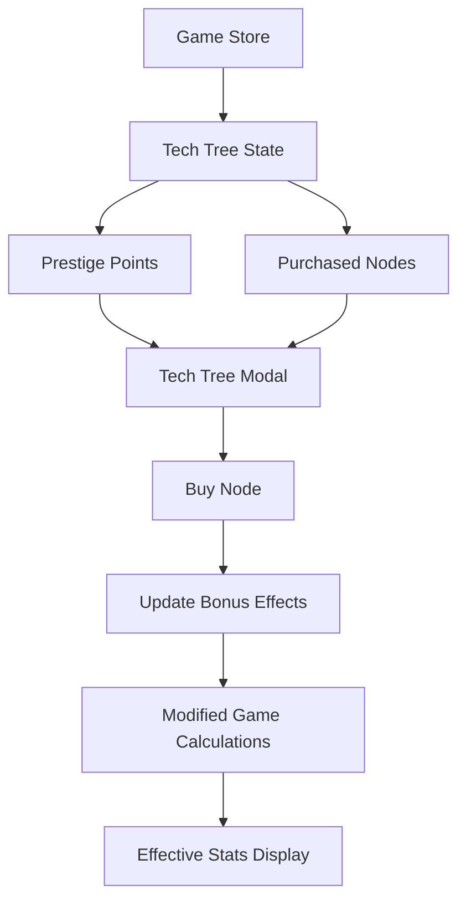

# Phase 4: Tech Tree Progression - Implementation Plan

## Overview
Phase 4 adds a long-term progression system with 4 tech trees (one per prestige path), each containing 10 nodes that provide permanent bonuses. This creates meaningful choices across prestige runs and gives players lasting goals beyond individual runs.

## Architecture

### Data Flow Diagram


### Tech Tree Structure

Each tree has 10 nodes with escalating costs: **1, 3, 5, 10, 15, 20, 25, 30, 35, 40 prestige points**

#### 1. Buyout Tree (Cash Focus)
| Node | Cost | Effect |
|------|------|--------|
| Seed Funding | 1 | +5,000 starting cash |
| Angel Investor | 3 | +15,000 starting cash |
| Series A | 5 | +30% cash multiplier |
| Acqui-hire | 10 | Auto-purchase upgrades <10% of current LoC |
| IPO | 15 | +50% prestige point gain |
| Venture Capital | 20 | +40% cash multiplier |
| Strategic Buyout | 25 | +60% starting cash |
| Market Dominance | 30 | Auto-purchase upgrades <15% of current LoC |
| Unicorn Status | 35 | +100% prestige point gain |
| Tech Empire | 40 | Complete mastery of cash generation |

#### 2. Nirvana Tree (LoC Focus)
| Node | Cost | Effect |
|------|------|--------|
| Copilot+ | 1 | +10% LoC per click |
| Vibe Streak | 3 | +20% LoC per click |
| Prompt Engineer | 5 | +30% LoC per click |
| AI Whisperer | 10 | +50% LoC per click |
| AGI Integration | 15 | +100% LoC per click |
| Neural Enhancement | 20 | +25% passive LoC rate |
| Quantum Code | 25 | +50% LoC multiplier |
| Digital Transcendence | 30 | Auto-click every 2 seconds |
| Cosmic Computing | 35 | +100% passive LoC rate |
| Singularity | 40 | 10x all LoC generation |

#### 3. Linus Tree (Cred Focus)
| Node | Cost | Effect |
|------|------|--------|
| OSS Contributor | 1 | +20% cred gain |
| Kernel Commit | 3 | +30% cred gain |
| Maintainer | 5 | +50% cred gain |
| Linus Blessing | 10 | +100% cred gain |
| GitHub Star | 15 | Unlock all projects 10 cred earlier |
| Project Maintainer | 20 | +40% cred gain |
| Open Source Legend | 25 | +60% cred gain |
| Code Celebrity | 30 | +80% cred gain |
| Industry Icon | 35 | Unlock all projects 25 cred earlier |
| Living Legend | 40 | 5x all cred generation |

#### 4. Learning Tree (Debt Management Focus)
| Node | Cost | Effect |
|------|------|--------|
| Read the Docs | 1 | -5% debt accumulation |
| Rubber Duck Debugging | 3 | -10% debt accumulation |
| Pair Programming | 5 | -15% debt penalty |
| Code Review | 10 | -20% debt penalty |
| Technical Debt Sprint | 15 | 2× debt clearing efficiency |
| Refactoring | 20 | -25% debt accumulation |
| Writing Tests | 25 | -30% debt penalty |
| Architecture Patterns | 30 | 3× debt clearing efficiency |
| Legacy Whisperer | 35 | Debt penalty becomes bonus at high levels |
| Code Zen | 40 | Complete mastery over tech debt |

## Implementation Steps

### Step 1: Update Types (types.ts)
- Add `TechTreeNode` interface with id, name, description, cost, effect type, effect value
- Add `TechTree` interface with path id, nodes array
- Update `PrestigePath` type to include 'learning'
- Add `TechTreeState` to `PrestigeState`
- Update `PrestigeBonuses` to include tech tree bonus fields

### Step 2: Update Constants (constants.ts)
- Add `TECH_TREES` constant with all 4 trees and 10 nodes each
- Define node effects as enum-like objects for type safety
- Set up cost progression: [1, 3, 5, 10, 15, 20, 25, 30, 35, 40]

### Step 3: Update Store (store.svelte.ts)
- Add `showTechTreeModal` state
- Add tech tree getter methods:
  - `effectiveDebtAccumulationPerClick` - applies learning tree modifiers
  - `effectiveDebtPenaltyFactor` - applies learning tree modifiers
  - `effectiveDebtClearingEfficiency` - applies learning tree modifiers
  - `effectiveCredUnlockThreshold` - applies linus tree modifiers
- Add `purchaseTechTreeNode(path, nodeIndex)` method
- Add `canPurchaseTechTreeNode(path, nodeIndex)` method
- Update `prestige` state initialization to include tech trees
- Ensure tech tree bonuses persist and stack with prestige bonuses

### Step 4: Create TechTreeModal Component
- Display 4 tabs for each tree
- Show prestige point total at top
- Vertical node list with connecting lines
- Visual states:
  - **Locked**: grayed out, shows lock icon
  - **Available**: shows cost, clickable
  - **Purchased**: green border, checkmark
- Click handler to purchase nodes
- Confirmation for expensive nodes (>10 points)

### Step 5: Update StatsPanel
- Add "Tech Tree" button next to prestige button
- Show prestige point count prominently
- Visual indicator when new nodes are available

### Step 6: Update PrestigePathModal
- Add 4th path: "Learning to... code?"
- Update path selection UI to accommodate 4 columns
- Add learning path bonuses display:
  - Starting debt relief: -0.02 per point
  - Debt accumulation reduction: -5% per point
  - Debt penalty reduction: -5% per point

### Step 7: Integrate Effects into Calculations
Update the following calculations to include tech tree modifiers:

1. **Debt Accumulation**:
   ```typescript
   get effectiveDebtAccumulationPerClick() {
       const base = TECH_DEBT.BASE_ACCUMULATION + (this.gameState.projectsShipped * TECH_DEBT.PER_PROJECT);
       const reduction = this.techTreeModifiers.debtAccumulationReduction;
       return base * (1 - reduction);
   }
   ```

2. **Debt Penalty**:
   ```typescript
   get effectiveDebtPenaltyFactor() {
       const base = Math.pow(1 - this.gameState.techDebt, 2);
       const mitigation = this.techTreeModifiers.debtPenaltyMitigation;
       // Apply mitigation to make penalty less severe
       return base + (1 - base) * mitigation;
   }
   ```

3. **Debt Clearing Efficiency**:
   ```typescript
   get effectiveDebtClearingEfficiency() {
       return this.techTreeModifiers.debtClearingMultiplier;
   }
   ```

4. **Cred Unlock Threshold**:
   ```typescript
   get effectiveCredUnlockThreshold() {
       const base = UNLOCKS.projects[cred].cred;
       const reduction = this.techTreeModifiers.credThresholdReduction;
       return Math.floor(base * (1 - reduction));
   }
   ```

## File Changes Summary

| File | Changes |
|------|---------|
| `src/lib/game/types.ts` | Add TechTreeNode, TechTree, TechTreeState interfaces; update PrestigePath type; extend PrestigeBonuses |
| `src/lib/game/constants.ts` | Add TECH_TREES constant with all 4 trees and 40 nodes |
| `src/lib/game/store.svelte.ts` | Add tech tree state, getters, purchase methods; update prestige reset logic |
| `src/lib/components/TechTreeModal.svelte` | New component - 4-tab modal with tree visualization |
| `src/lib/components/StatsPanel.svelte` | Add tech tree button and prestige point display |
| `src/lib/components/PrestigePathModal.svelte` | Add 4th path (learning) to path selection |
| `src/App.svelte` | Import and mount TechTreeModal |

## Acceptance Criteria Checklist

- [ ] Four separate tech trees accessible via tabs
- [ ] Nodes displayed in vertical list with connecting lines
- [ ] Purchased nodes visually distinct (green border, checkmark)
- [ ] Available but unpurchased nodes show cost and are clickable
- [ ] Locked nodes (prerequisite not met) are grayed out
- [ ] Prestige point total displayed at top of each tree
- [ ] Each node has a unique, meaningful effect
- [ ] Effects stack additively with prestige bonuses
- [ ] Effects persist across all future runs
- [ ] Node descriptions clearly explain the effect

## Visual Design Notes

- **Tree visualization**: Vertical line connecting nodes (CSS border-left)
- **Node cards**: 100% width, 60px height, 8px gap
- **Colors per tree**:
  - Buyout: #00ff00 (green)
  - Nirvana: #00ccff (cyan)
  - Linus: #ffb000 (amber)
  - Learning: #ff00ff (magenta)
- **Connecting lines**: 2px dashed line between nodes
- **Lock icon**: 🔒 for locked nodes
- **Checkmark**: ✓ for purchased nodes
- **Hover effects**: Subtle glow matching tree color
