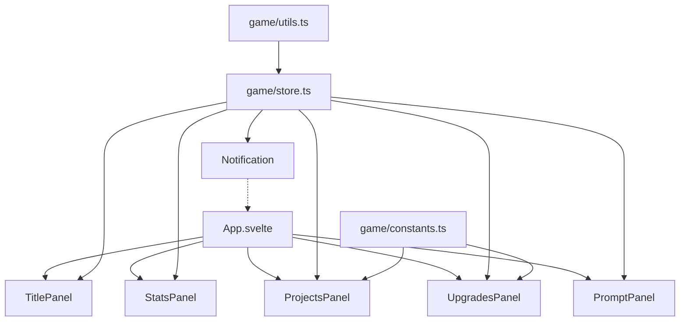
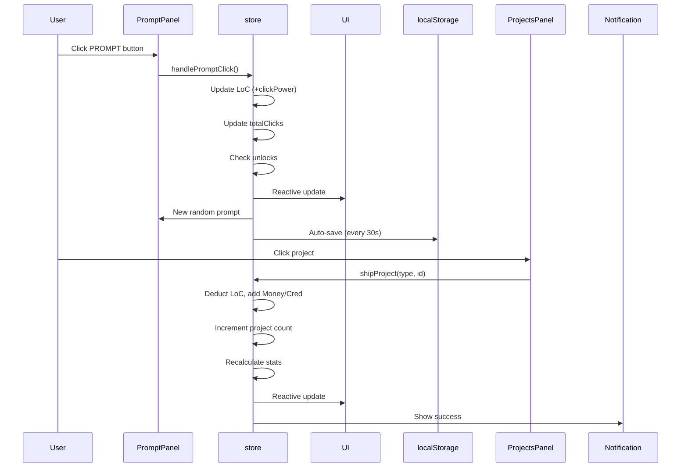

# Vibe Code Guru - v0.3 Migration Plan
## Vanilla HTML/CSS/JS → Svelte 5 + Vite

## Overview

Migrate the existing 3-file "Vibe Code Guru" clicker game from vanilla HTML/CSS/JS to a Svelte 5 + Vite application. This will improve developer experience with reactive state management, component-based architecture, and better tooling.

## Game Summary

**Core Mechanics:**
- Click "PROMPT" button to generate Lines of Code (LoC)
- Ship projects to convert LoC → Money + Cred
- Buy upgrades with money to increase:
  - Click power (Vibe Code upgrades)
  - Auto-generation (Delegation upgrades)
- Unlock new projects/upgrades based on Cred

**Resources:** Money, LoC, Cred

**Project Categories:**
- Standard: One-time rewards (Todo App, Calculator, etc.)
- SaaS: Recurring passive income (Mini CRM, Analytics Tool, etc.)
- Open Source: Cred-focused rewards (CLI Utility, Library, etc.)

---

## Migration Architecture

### Svelte 5 Runes to Use
- `$state` - Reactive game state
- `$derived` - Computed values (click power, auto rate, passive income)
- `$effect` - Side effects (game loop, auto-save, float text animations)
- `$props` - Component props (if needed)
- `$bindable` - Two-way binding (if needed)

### Project Structure

```
vibecodeguru/src/
├── lib/
│   ├── game/
│   │   ├── constants.ts      # PROJECTS, UPGRADES, UNLOCKS, PROMPT_MESSAGES
│   │   ├── types.ts          # TypeScript interfaces
│   │   ├── store.ts          # Game state using $state rune
│   │   └── utils.ts          # Helper functions (formatNumber, etc.)
│   ├── components/
│   │   ├── TitlePanel.svelte
│   │   ├── StatsPanel.svelte
│   │   ├── ProjectsPanel.svelte
│   │   ├── UpgradesPanel.svelte
│   │   ├── PromptPanel.svelte
│   │   └── Notification.svelte
│   └── assets/
│       └── (existing assets)
├── App.svelte                # Main layout component
├── main.ts                   # Entry point
└── app.css                   # Global styles (theme variables, reset)
```

---

## Detailed Implementation Steps

### Step 1: Game Constants & Types

**File:** `src/lib/game/constants.ts`
- Extract `PROJECTS`, `UPGRADES`, `UNLOCKS`, `PROMPT_MESSAGES` from game.js
- Keep as pure data (no reactivity)

**File:** `src/lib/game/types.ts`
```typescript
interface Resources {
    money: number;
    loc: number;
    cred: number;
}

interface GameState {
    resources: Resources;
    upgrades: {
        vibeCode: Record<number, number>;
        delegation: Record<number, number>;
    };
    projects: {
        standard: Record<string, number>;
        saas: Record<string, number>;
        openSource: Record<string, number>;
    };
    totalClicks: number;
    activeTab: {
        projects: 'standard' | 'saas' | 'openSource';
        upgrades: 'vibeCode' | 'delegation';
    };
}

interface Project {
    id: string;
    name: string;
    locCost: number;
    reward: number;
    cred: number;
    recurring?: boolean;
}

interface Upgrade {
    level: number;
    cost: number;
    multiplier?: number;
    autoLoc?: number;
    name: string;
    desc: string;
}
```

### Step 2: Game Store (Reactive State)

**File:** `src/lib/game/store.ts`
- Use `$state` for game state
- Implement save/load with localStorage
- Create actions as regular functions that modify state
- `$derived` for computed values (clickPower, autoClickRate, passiveIncome)

```typescript
// Core pattern
let gameState = $state<GameState>({
    resources: { money: 0, loc: 0, cred: 0 },
    upgrades: { vibeCode: {}, delegation: {} },
    projects: { standard: {}, saas: {}, openSource: {} },
    totalClicks: 0,
    activeTab: { projects: 'standard', upgrades: 'vibeCode' }
});

// Computed values
let clickPower = $derived(Math.pow(2, totalVibeCodeLevels));
let autoClickRate = $derived(calculatedAutoRate);
let passiveIncome = $derived(calculatedPassiveIncome);

// Actions
function handlePromptClick(event: MouseEvent) { ... }
function shipProject(type: ProjectType, projectId: string) { ... }
function buyUpgrade(type: UpgradeType, level: number) { ... }
function saveGame() { ... }
function loadGame() { ... }
function resetGame() { ... }
```

### Step 3: Utility Functions

**File:** `src/lib/game/utils.ts`
- `formatNumber(num)` - Format numbers (1.2K, 1.5M, etc.)
- `getUpgradeCost(upgrade, count)` - Calculate upgrade cost with scaling
- `getUnlockedProjects()` - Get list of unlocked project IDs
- `getMaxUpgradeLevel(type)` - Get max upgrade level based on cred

### Step 4: Component Implementation

#### `TitlePanel.svelte`
- Display ASCII art title
- Save/Reset buttons
- Connect to store actions

#### `StatsPanel.svelte`
- Display all resource values
- Use `$derived` for formatted values
- Reactive updates when state changes

#### `ProjectsPanel.svelte`
- Tab navigation (Standard/SaaS/Open Source)
- Render project list based on active tab
- Each project item shows:
  - Name (+ count if owned)
  - Cost (LoC)
  - Reward ($ + Cred + recurring indicator)
- Locked state with required cred
- Click to ship project

#### `UpgradesPanel.svelte`
- Tab navigation (Vibe Code/Delegation)
- Render upgrade list based on active tab
- Each upgrade item shows:
  - Name (+ owned count)
  - Current cost (with scaling)
  - Description
- Locked state with required cred
- Click to buy upgrade

#### `PromptPanel.svelte`
- Display random prompt message
- Large clickable PROMPT button
- Show float text animation on click
- Handle click event → store action

#### `Notification.svelte`
- Toast notifications for game events
- Auto-dismiss after 2 seconds
- Slide-in animation

### Step 5: Main App Component

**File:** `src/App.svelte`
- Grid layout matching original design
- Import and render all panels
- Global notification handling
- Mount floating text container

### Step 6: Global Styles

**File:** `src/app.css`
- Move CSS variables from styles.css
- Reset styles
- Terminal font family
- Grid layout styles
- Scrollbar styling
- Animation keyframes

---

## Mermaid: Component Architecture



---

## Data Flow



---

## Implementation Order

1. **Setup & Constants**
   - [ ] Create `src/lib/game/` directory
   - [ ] Create `constants.ts` with game data
   - [ ] Create `types.ts` with TypeScript interfaces
   - [ ] Create `utils.ts` with helper functions

2. **Game Store**
   - [ ] Create `store.ts` with `$state` game state
   - [ ] Implement `$derived` computed values
   - [ ] Implement game actions (click, ship, buy, save, load, reset)
   - [ ] Implement game loop with `$effect`
   - [ ] Implement auto-save with `$effect`

3. **Components**
   - [ ] Create `TitlePanel.svelte`
   - [ ] Create `StatsPanel.svelte`
   - [ ] Create `ProjectsPanel.svelte`
   - [ ] Create `UpgradesPanel.svelte`
   - [ ] Create `PromptPanel.svelte`
   - [ ] Create `Notification.svelte`

4. **Main App & Styles**
   - [ ] Update `App.svelte` with grid layout
   - [ ] Update `app.css` with terminal theme
   - [ ] Clean up default Svelte files

5. **Testing & Polish**
   - [ ] Verify all game mechanics work
   - [ ] Test save/load functionality
   - [ ] Test unlock progression
   - [ ] Verify animations work
   - [ ] Test responsive layout

---

## Migration Benefits

1. **Reactive State** - No more manual DOM updates
2. **Type Safety** - TypeScript throughout
3. **Component Isolation** - Easier to maintain
4. **Better Tooling** - HMR, type checking, IDE support
5. **Svelte 5 Runes** - Modern reactive primitives
6. **Scoped CSS** - Component-level styling
7. **Dev Experience** - Better debugging, hot reload

---

## Files to Create/Modify

**New Files:**
- `src/lib/game/constants.ts`
- `src/lib/game/types.ts`
- `src/lib/game/store.ts`
- `src/lib/game/utils.ts`
- `src/lib/components/TitlePanel.svelte`
- `src/lib/components/StatsPanel.svelte`
- `src/lib/components/ProjectsPanel.svelte`
- `src/lib/components/UpgradesPanel.svelte`
- `src/lib/components/PromptPanel.svelte`
- `src/lib/components/Notification.svelte`

**Files to Modify:**
- `src/App.svelte` - Replace with game layout
- `src/app.css` - Add terminal theme styles
- `src/main.ts` - (likely no changes needed)

**Files to Delete:**
- `src/lib/Counter.svelte` - Remove default component
- `src/assets/svelte.svg` - Remove if not needed
- `src/assets/svelte.svg` - Remove if not needed

---

## Version Bump

- Current: v0.2 (from index.html title)
- New: v0.3

Update title in components to reflect v0.3.
